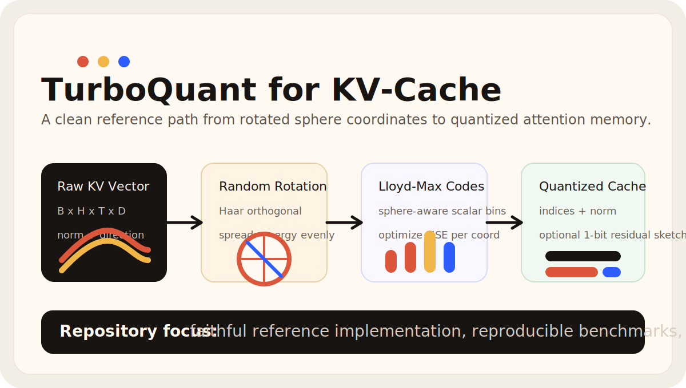
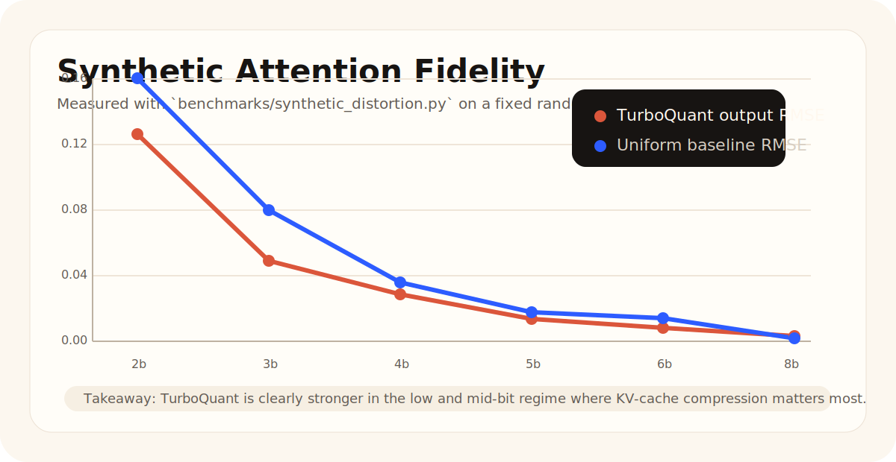
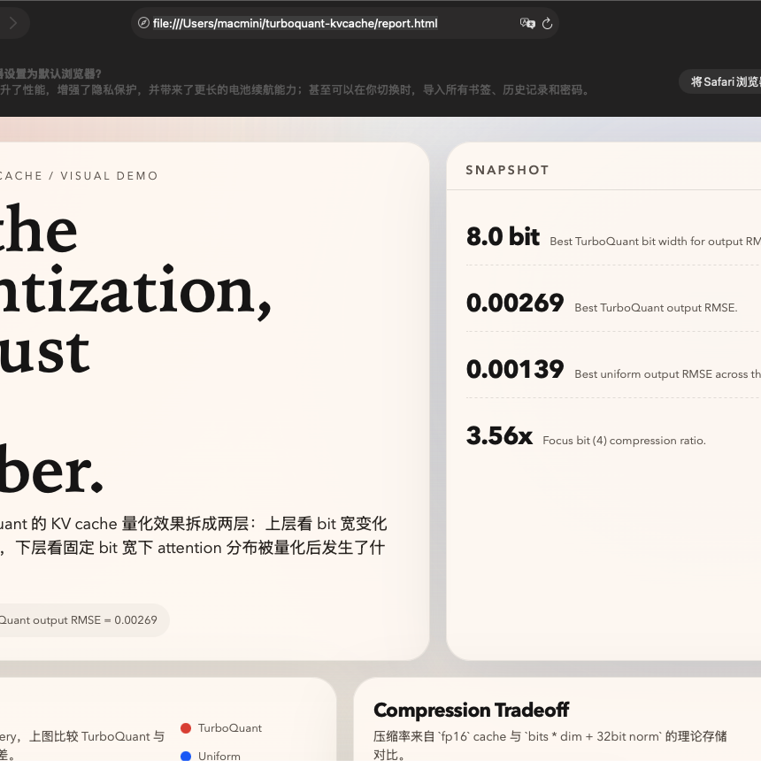

<div align="center">
  
  <h1>TurboQuant KV-Cache</h1>
  <p><strong>A faithful, reproducible, and extensible reference implementation of TurboQuant for KV-cache quantization.</strong></p>
  <p>
    <a href="https://github.com/2023Anita/turboquant-kvcache/actions/workflows/ci.yml"></a>
    <a href="LICENSE"></a>
    <a href="https://arxiv.org/html/2504.19874v1"></a>
    <a href="https://www.python.org/downloads/"></a>
  </p>
</div>

TurboQuant comes from the paper **TurboQuant: An Efficient and Accurate KV Cache Quantization Method**:

- Paper: <https://arxiv.org/html/2504.19874v1>

This repository implements the paper's core algorithmic path in a way that is easy to audit, benchmark, and extend:

- random orthogonal rotation before quantization
- Lloyd-Max scalar quantization matched to sphere-coordinate statistics
- KV-cache oriented quantization for tensors shaped like `B x H x T x D`
- inner-product estimation via MSE quantization plus a 1-bit residual sketch
- synthetic distortion benchmarks and a self-contained HTML visual report

## Why This Repo

Most KV-cache quantization repositories jump directly into inference integration. This repository takes a cleaner first step:

- make the method legible in code
- make the numerical behavior reproducible
- make future runtime integration easier by preserving a simple reference path

If you want to understand the method before optimizing it, this is the repository.

## Current Status

Implemented in `v0.1.0`:

- `TurboQuantMSEQuantizer`
- `TurboQuantInnerProductQuantizer`
- `TurboQuantKVCacheCodec`
- synthetic KV-cache benchmark suite
- browser-friendly HTML report
- CI, tests, and project scaffolding

Not implemented yet:

- entropy coding for codebook pointers
- fractional-bit channel split such as `2.5 / 3.5 bits per channel`
- CUDA or Triton kernels
- Hugging Face, vLLM, or sglang integration
- full long-context paper reproduction

## Method Sketch

<div align="center">
  
</div>

TurboQuant, in this repository, follows the high-level flow:

1. Split each KV vector into norm and direction.
2. Apply a random Haar orthogonal rotation to the direction.
3. Quantize the rotated coordinates with a Lloyd-Max scalar quantizer derived from sphere-coordinate statistics.
4. Store quantized indices plus one norm per vector.
5. Optionally sketch the residual with a 1-bit projection for inner-product estimation.

The current implementation quantizes the last dimension of KV-cache tensors, i.e. one per-token per-head vector at a time.

## Quickstart

```bash
git clone https://github.com/2023Anita/turboquant-kvcache.git
cd turboquant-kvcache
python3 -m pip install -e .[dev]
```

Run the reference demo:

```bash
PYTHONPATH=src python3 demos/reference_demo.py --bits 4 --seq-len 256 --heads 8 --head-dim 128 --batch 2
```

Run the synthetic benchmark:

```bash
PYTHONPATH=src python3 benchmarks/synthetic_distortion.py --bits-list 2,3,4,5,6,8
```

Generate the self-contained visual report:

```bash
PYTHONPATH=src python3 demos/visual_report.py
```

Preview of the generated local report:

<div align="center">
  
</div>

## Snapshot Numbers

One representative synthetic run with `seq_len=64`, `heads=4`, `head_dim=64`, `batch=1`:

| bits | compression | attention RMSE | uniform baseline RMSE |
| --- | --- | --- | --- |
| 2.0 | 6.40x | 0.126517 | 0.160582 |
| 3.0 | 4.57x | 0.049346 | 0.079712 |
| 4.0 | 3.56x | 0.028630 | 0.035972 |
| 5.0 | 2.91x | 0.013776 | 0.017736 |
| 6.0 | 2.46x | 0.008168 | 0.007210 |
| 8.0 | 1.88x | 0.003148 | 0.001726 |

These numbers are synthetic, not full paper-scale model evaluation. They are here to validate the implementation behavior and low-bit trend.

## Repository Layout

```text
turboquant-kvcache/
  src/turboquant_kvcache/
  benchmarks/
  demos/
  tests/
  docs/
  assets/
```

## Core API

```python
from turboquant_kvcache import TurboQuantKVCacheCodec

codec = TurboQuantKVCacheCodec(head_dim=128, bits=4.0, seed=0)
pack = codec.encode(key_cache, value_cache)
key_hat, value_hat = codec.decode(pack)
metrics = codec.evaluate(query, key_cache, value_cache)
```

## Development

Run the local workflow:

```bash
make test
make demo
make benchmark
make report
```

If `make` is unavailable, the commands are listed in [CONTRIBUTING.md](CONTRIBUTING.md).

## Documentation

- [Method Notes](docs/method.md)
- [Benchmarks](docs/benchmarks.md)
- [Reproducibility](docs/reproducibility.md)
- [Changelog](CHANGELOG.md)

## Roadmap

1. Add packing utilities and entropy coding.
2. Add mixed-bit and outlier-aware channel policies.
3. Integrate with a Hugging Face attention cache path.
4. Add long-context evaluation against real models.
5. Add optimized Triton or CUDA kernels.

## Contributing

Contributions are welcome. Start with [CONTRIBUTING.md](CONTRIBUTING.md) and keep algorithmic changes easy to reproduce.

## Citation

If you use this repository, please cite the original TurboQuant paper. GitHub-compatible citation metadata is available in [CITATION.cff](CITATION.cff).
